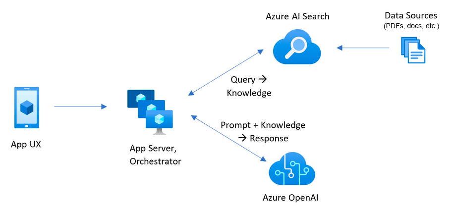

# RAG 기반 AI 채팅앱 샘플 소개

이 샘플 앱은 사용자가 자신의 자료(PDF, 문서 등)를 RAG(Relevance-Augmented Generation) 방식으로 활용하여 AI 채팅앱을 직접 구동해볼 수 있도록 제공합니다. 사용자는 본인의 데이터를 업로드하고, Azure OpenAI와 Azure AI Search를 연동하여 자연어로 질문을 하면, 앱이 관련 정보를 검색하고 AI가 답변을 생성합니다.

주요 기능:
- **자료 업로드 및 인덱싱**: 사용자가 원하는 자료를 등록하면, Azure AI Search가 이를 인덱싱하여 검색이 가능하게 만듭니다.
- **RAG 기반 질의응답**: 사용자의 질문에 대해 검색 결과를 바탕으로 Azure OpenAI가 자연어 답변을 생성합니다.
- **직관적 챗 인터페이스**: 누구나 쉽게 사용할 수 있는 챗 UI를 통해 대화형 검색 및 응답을 경험할 수 있습니다.

이 샘플 앱은 기업 내 문서 검색, 교육 자료 활용, 고객 지원 등 다양한 시나리오에 적용할 수 있으며, RAG와 Azure 서비스를 직접 체험해볼 수 있는 실습 환경을 제공합니다.

## 1. 왜 RAG를 사용해야 하는가?
RAG(Relevance-Augmented Generation)는 대규모 언어 모델(LLM)과 검색 기술을 결합하여 더 정확하고 신뢰할 수 있는 응답을 제공합니다. 단순히 LLM만 사용하는 경우, 최신 정보나 특정 데이터베이스에 대한 접근이 제한될 수 있습니다. RAG는 이를 보완하여 다음과 같은 장점을 제공합니다:

- **정확성 향상**: 검색 기술을 통해 최신 정보와 신뢰할 수 있는 데이터를 제공합니다.
- **효율성**: 대규모 데이터 세트에서 필요한 정보를 빠르게 검색하여 응답 시간을 단축합니다.
- **확장성**: 다양한 데이터 소스와 통합하여 더 많은 정보를 처리할 수 있습니다.

## 2. 왜 클라우드 서버와 Azure를 사용해야 하는가?
클라우드 서버는 데이터 저장, 처리, 확장성을 제공하며, 애플리케이션 개발 및 배포를 간소화합니다. Azure는 클라우드 서비스 중 하나로, 다음과 같은 이유로 추천됩니다:

- **유연성**: 다양한 서비스와 도구를 제공하여 애플리케이션 요구 사항에 맞게 조정 가능합니다.
- **보안**: 엔터프라이즈급 보안 기능을 제공하여 데이터 보호를 강화합니다.
- **비용 효율성**: 사용한 만큼만 비용을 지불하는 모델로 운영 비용을 절감할 수 있습니다.

Azure에서는 OpenAI의 모델을 바로 사용할 수 있으며, AI 검색 관련 서비스(Azure AI Search)도 손쉽게 연동할 수 있어 효율적인 개발이 가능합니다. 이러한 통합 환경 덕분에 최신 AI 기능과 강력한 검색 서비스를 빠르게 적용할 수 있습니다.

## 3. RAG의 구성 요소 및 단계별 개념 설명
RAG는 대규모 언어 모델과 검색 기술을 결합하여 사용자 질문에 대한 정확하고 신뢰할 수 있는 응답을 제공합니다. 이를 구현하기 위해 다음과 같은 구성 요소와 단계가 포함됩니다:

### 구성 요소
- **프론트엔드**: 사용자와 상호작용하는 챗봇 UI를 통해 질문을 입력받습니다.
- **백엔드**: API를 통해 데이터 요청을 처리하고, 지식베이스 데이터베이스를 관리합니다.
- **서버**: 클라우드 환경(Azure)을 통해 데이터 저장 및 처리를 수행합니다.

### 단계별 개념 설명
1. **질문 입력**: 사용자가 챗봇 UI를 통해 질문을 입력합니다.
2. **검색**: 백엔드에서 Azure AI Search를 사용하여 관련 데이터를 검색합니다.
3. **응답 생성**: 검색된 데이터를 기반으로 Azure OpenAI가 자연어 응답을 생성합니다.
4. **응답 제공**: 생성된 응답이 사용자에게 전달됩니다.

### App 구성 요소 및 단계별 흐름
아래 이미지는 RAG의 구성 요소와 데이터 흐름을 시각적으로 보여줍니다:
- **App UX**: 사용자 인터페이스에서 질문을 입력합니다.
- **App Server, Orchestrator**: 서버에서 데이터 요청을 처리하고, 검색 및 응답 생성을 조율합니다.
- **Azure AI Search**: 데이터 소스(PDF, 문서 등)에서 관련 정보를 검색합니다.
- **Azure OpenAI**: 검색된 정보를 기반으로 자연어 응답을 생성합니다.

