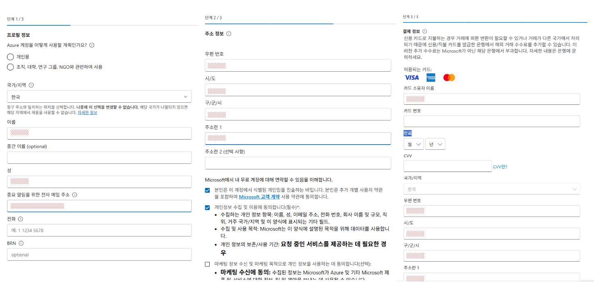

# 1. GitHub 계정 생성 방법

## 1-1. 계정이 이미 있는 경우
1. [GitHub 로그인 페이지](https://github.com/login)로 이동합니다.
2. 이메일 주소와 비밀번호를 입력하고 **Sign in** 버튼을 클릭합니다.
3. 로그인 후 GitHub 대시보드에 접속할 수 있습니다.

## 1-2. 신규 가입이 필요한 경우
1. [GitHub 가입 페이지](https://github.com/signup)로 이동합니다.
2. 이메일 주소를 입력합니다.
3. 비밀번호를 입력합니다. 
4. 사용자 이름을 입력합니다.
5. 국가/지역을 선택합니다.
6. **Create account** 버튼을 클릭합니다.
7. 이메일 인증을 완료하고, 추가 정보를 입력합니다.
8. 가입 완료 후 로그인합니다.

---

# 2. Azure 계정 생성 방법

## 시작
1. [Azure 무료 계정 페이지](https://azure.microsoft.com/free/)로 이동합니다.
2. **무료로 시작** 버튼을 클릭합니다.
3. 로그인 화면이 나타나면, 이미 사용 중인 MS 계정으로 로그인하거나 신규 계정을 생성할 수 있습니다. 2-1, 2-2, 2-3 중 하나의 방법을 선택하여 MS 계정으로 로그인을 진행합니다.

## Azure 무료 계정 혜택
- 신규 Azure 고객만 제공됩니다.
- 20개 이상의 인기 서비스에 대해 12개월 동안 제공되는 월별 무료 이용 혜택을 받을 수 있습니다.
- 65개 이상의 상시 무료 서비스의 월간 무료 이용 혜택을 제공합니다.
- 최대 USD$200 크레딧을 통해 전체 서비스 카탈로그에 액세스할 수 있습니다.
- 지출 보호: 신용 카드에 요금이 청구되지 않습니다.
- 사전 약정이 없으며, 언제든지 취소 가능합니다.
- 30일이 지나거나 크레딧을 모두 소진한 후에도 계속 사용하려면 용량제 요금으로 전환됩니다.

    **이 샘플 앱은 Azure 무료 계정 혜택을 활용하여 구동합니다.**

## 2-1. MS 계정으로 로그인
1. 이미 사용중인 Microsoft 계정이 있다면, 해당 계정으로 로그인합니다.
2. **다음** 버튼을 클릭하여 로그인 절차를 완료합니다.

## 2-2. 신규 계정 생성
1. **계정을 만드세요!** 링크를 클릭하여 새 Microsoft 계정을 생성합니다.
2. 이미 사용 중인 이메일 주소를 입력합니다.
3. 이메일로 전송된 인증 코드를 확인하고 입력합니다.
4. 국가와 생년월일을 입력합니다.
5. 성과 이름을 입력합니다.
6. 가입 완료 후 로그인 절차를 완료합니다.

## 2-3. GitHub 계정 연동
1. 로그인 화면에서 **GitHub로 로그인** 옵션을 선택합니다.
2. GitHub 계정 정보를 입력하고 인증 절차를 완료합니다.
3. Azure 계정과 GitHub 계정이 연동됩니다.

## 2-4. Azure 체험 계정 생성
1. MS 계정 로그인을 완료한 후, Azure 체험 계정 생성 페이지로 이동합니다.

2. **Azure 계정을 어떻게 사용할 계획인가요?**에서 개인용을 선택합니다.
3. 국가/지역을 선택합니다.
4. 성, 이름을 입력합니다.
5. 중요한 알림을 받을 전자 메일 주소를 입력합니다.
6. 전화번호를 입력합니다.
7. **다음** 버튼을 클릭하여 다음 단계로 진행합니다.
8. 주소 정보를 입력합니다:
   - 우편 번호를 입력합니다.
   - 시/도를 입력합니다.
   - 구/군/시를 입력합니다.
   - 주소란 1에 상세 주소를 입력합니다.
9. 개인정보 수집 및 이용에 동의합니다.
10. **다음** 버튼을 클릭하여 다음 단계로 진행합니다.
11. 결제 정보를 입력합니다:
    - 카드 소유자 이름을 입력합니다.
    - 카드 번호를 입력합니다.
    - 카드 만료 월/년을 선택합니다.
    - CVV 코드를 입력합니다.
    - 국가/지역 및 주소 정보를 확인합니다.
12. **등록** 버튼을 클릭하여 계정 생성 절차를 완료합니다.

---
