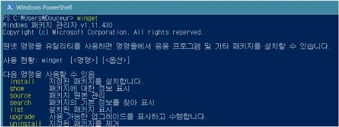
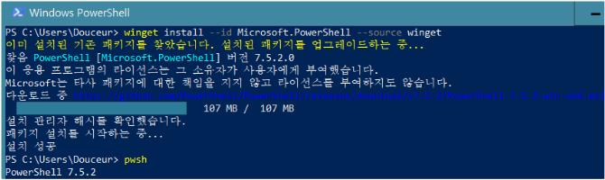
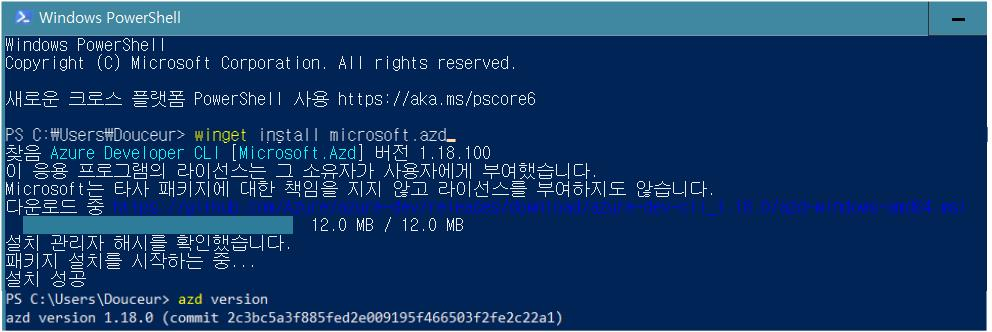
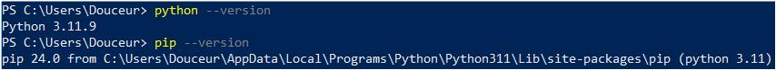
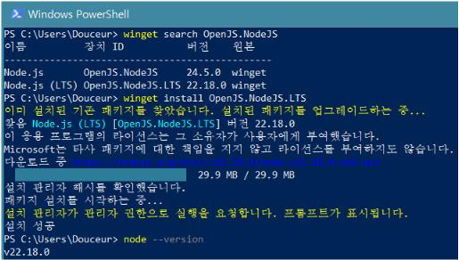
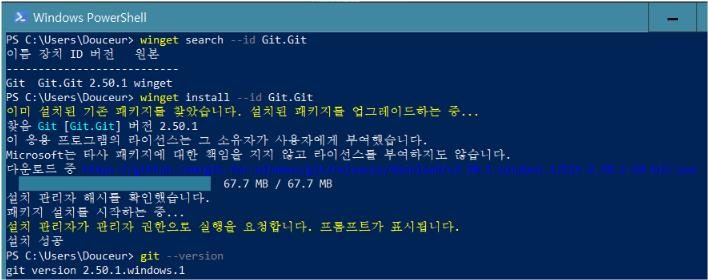

# 로컬 환경 설정 가이드

이 가이드는 이 프로젝트를 로컬 환경에서 실행하기 위해 필요한 도구와 설치 방법을 안내합니다.

## 필수 설치 항목
winget은 Windows에서 패키지를 설치하고 관리하는 도구입니다. 이 가이드를 따라 설치를 진행하기 전에, 먼저 `winget`이 설치되어 있는지 확인하세요. `winget`은 Windows 10 1809 버전 이상에서 기본적으로 제공됩니다.
   

1. **Powershell 7 이상 (pwsh)** (Windows 사용자 전용)
   - PowerShell은 Azure CLI와 함께 사용되며, 최신 버전이 필요합니다.
   - **설치 방법**:
   - 설치 링크: [Powershell 다운로드](https://github.com/powershell/powershell)
      - PowerShell을 열고 아래 명령어를 실행합니다:
         ```
         winget install --id Microsoft.PowerShell --source winget
         ```
      - 설치가 완료되면 PowerShell을 다시 열고 `pwsh` 명령어를 입력하여 설치가 성공적으로 완료되었는지 확인합니다:
         ```
         pwsh
         ```
      - 성공적으로 설치되었다면 PowerShell의 버전 정보가 출력됩니다.
     

2. **Azure Developer CLI**
   - Azure Developer CLI는 Azure 리소스를 관리하고 배포하는 데 사용됩니다.
   - **설치 방법**:
      - 설치 링크: [Azure Developer CLI](https://aka.ms/azure-dev/install)
      - PowerShell을 열고 아래 명령어를 실행합니다:
         ```
         winget install microsoft.azd
         ```
      - 설치가 완료되면 `azd version` 명령어를 실행하여 설치가 성공적으로 완료되었는지 확인합니다:
         ```
         azd version
         ```
      - 성공적으로 설치되었다면 Azure Developer CLI의 버전 정보가 출력됩니다.
     

3. **Python 3.9, 3.10, 또는 3.11**
   - Python은 이 프로젝트의 백엔드에서 사용됩니다.
   - 이미 Python이 설치되어 있다면, 버전이 3.9, 3.10, 또는 3.11인지 확인해야 합니다.
   - **설치 방법**:
      - 설치 링크: [Python 다운로드](https://www.python.org/downloads/release/python-3119/)
      - PowerShell을 열고 아래 명령어를 실행합니다:
         ```
         winget install Python.Python.3.11
         ```
   - **설치 확인**:
      - 설치가 완료되면 `python --version` 명령어를 실행하여 설치가 성공적으로 완료되었는지 확인합니다:
         ```
         python --version
         ```
      - 성공적으로 설치되었다면 Python의 버전 정보가 출력됩니다.
      

4. **Node.js 20 이상**
   - Node.js는 이 프로젝트의 프론트엔드에서 사용됩니다.
   - **설치 방법**:
      - 설치 링크: [Node.js 다운로드](https://nodejs.org/ko/download)
      - PowerShell을 열고 아래 명령어를 실행합니다:
         ```
         winget install OpenJS.NodeJS.LTS
         ```
   - **설치 확인**:
      - 설치가 완료되면 `node --version` 명령어를 실행하여 설치가 성공적으로 완료되었는지 확인합니다:
         ```
         node --version
         ```
      - 성공적으로 설치되었다면 Node.js의 버전 정보가 출력됩니다.
      


5. **Git**
   - Git은 이 프로젝트의 버전 관리를 위해 사용됩니다.
   - **설치 방법**:
      - 설치 링크: [Git 다운로드](https://git-scm.com/downloads/win)
      - PowerShell을 열고 아래 명령어를 실행합니다:
         ```
         winget install --id Git.Git
         ```
   - **설치 확인**:
      - 설치가 완료되면 `git --version` 명령어를 실행하여 설치가 성공적으로 완료되었는지 확인합니다:
         ```
         git --version
         ```
      - 성공적으로 설치되었다면 Git의 버전 정보가 출력됩니다.
      

6. **Visual Studio Code**
   - Visual Studio Code는 이 프로젝트의 코드 편집기입니다.
   - **설치 방법**:
   - 설치 링크: [Visual Studio Code 다운로드](https://code.visualstudio.com/Download)
     - 'Download VS Code Windows 10, 11' 버튼을 클릭하여 설치 파일을 다운로드합니다.
     - 설치 파일을 실행하고 설치 마법사의 지시에 따라 설치를 완료합니다.
     - 설치가 완료되면 Visual Studio Code를 실행하여 정상적으로 설치되었는지 확인합니다.
