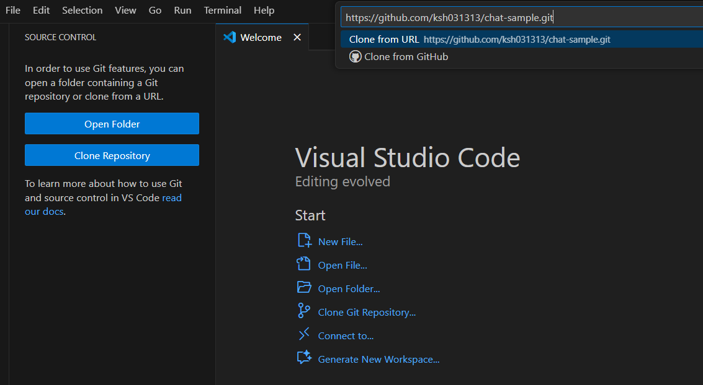

## Visual Studio Code를 사용하여 Git 소스 복제하기

1. **Visual Studio Code 실행**
   - Visual Studio Code를 실행합니다.

2. **Git URL 복사**
   - 복제하려는 Git 저장소의 URL을 복사합니다. 
   `https://github.com/ksh031313/chat-sample.git`

3. **Source Control 메뉴 열기**
   - Visual Studio Code의 Welcome 화면에서 "Clone Git Repository" 버튼을 클릭합니다.
   또는 좌측 Source Control 아이콘(🔄)을 클릭하고, "Clone Repository"를 선택합니다.

4. **URL 입력**
   - 복사한 Git URL을 입력하고 Enter 키를 누릅니다.
   

5. **저장 위치 선택**
   - 로컬 PC에 저장할 폴더를 선택합니다.

6. **복제 완료**
   - 저장소가 성공적으로 복제되면 Visual Studio Code에서 자동으로 열립니다.
